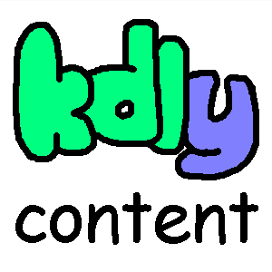

# Kdly Content

[>> Downloads <<](https://github.com/LemmaEOF/KdlyContent/releases)

*Snuggle up and make something!*

**This mod is open source and under a permissive license.** As such, it can be included in any modpack on any platform without prior permission. We appreciate hearing about people using our mods, but you do not need to ask to use them. See the [LICENSE file](LICENSE.md) for more details.

Kdly Content is a tool to define new blocks, items, and more statically in [kdl](https://kdl.dev). It's designed to be
extensible by mods both automatically and with intent.

Kdly Content works using [Static Data](https://modrinth.com/mod/static-data), allowing both modders and pack devs to add
new `staticdata/kdlycontent.kdl` files defining blocks, items, or any other content type added with mod support.

By default, Kdly Content allows defining blocks, items, tool/armor materials, and any dynamic registry types.
It also provides a load-condition framework to only define certain elements when a given mod is loaded, and a
rudimentary template system for easy definition of multiple similar content pieces.

For usage information, please see the [wiki](https://github.com/lemmaeof/kdlycontent/wiki).
